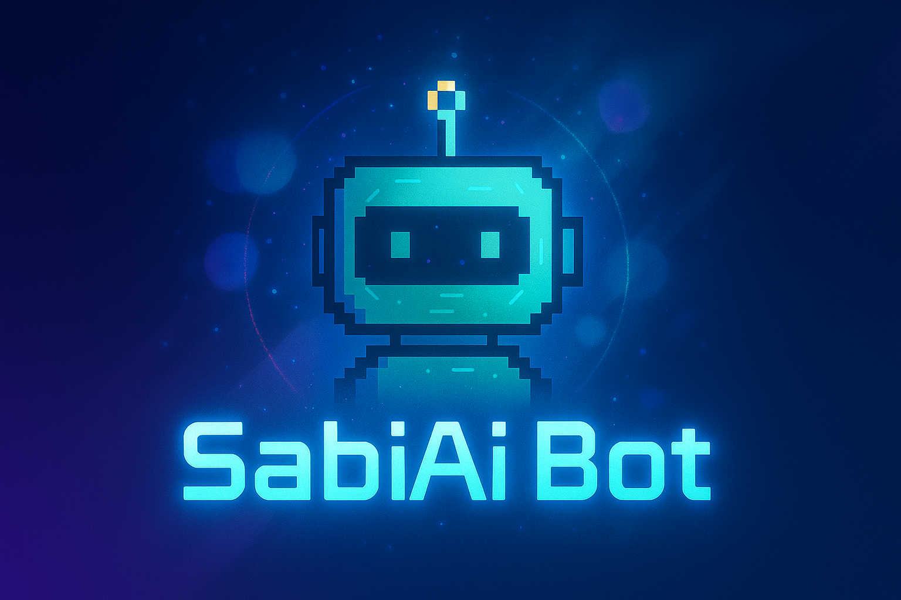

# SabiAi_BOT


[](LICENSE)
[](https://www.linkedin.com/in/elias-barbosa-367280282)



> **SabiAi Bot** é um assistente pessoal inteligente que integra a API Gemini e o Telegram para ajudar você no dia a dia.  
> O bot identifica, busca, adapta e revisa respostas para fornecer informações úteis, dicas e apoio.


## Tabela de Conteúdos
- [Requisitos](#requisitos)
- [Tecnologias](#tecnologias)
- [Instalação](#instalação)
- [Configuração](#configuração)
- [Como Usar](#como-usar)
- [Novidades (v1.1.0)](#novidades-(v1.1.0))
- [Contribuição](#contribuição)
- [Licença](#licença)

## Requisitos
- Python 3.10+
- Token de API do Telegram
- Chave de API do Gemini
- Pip configurado

## Tecnologias
| Tecnologia | Função |
|------------|--------|
| **Python** | Linguagem principal |
| **python-telegram-bot** | Criação do bot no Telegram |
| **Google Generative AI (Gemini)** | Geração de conteúdo inteligente |
| **asyncio** | Execução assíncrona |
| **datetime, os** | Utilitários padrão do Python |

## Instalação
1️⃣ Clone o repositório:
```bash
git clone https://github.com/Elias1800/Sabi.Ai_BOT.git
cd SabiAi_Bot
```
2️⃣ Instale as dependências:
```bash
pip install python-telegram-bot google-generativeai requests
```

## Configuração
Edite o arquivo main e insira suas chaves:
```python
TOKEN_TELEGRAM = 'SUA_CHAVE_TELEGRAM'
GEMINI_API_KEY = 'SUA_API_KEY'
```
💡 **Dica:** Para segurança, considere usar variáveis de ambiente no futuro.

## Como Usar
Execute no terminal:
```bash
python main.py
```
📌 O bot ficará aguardando mensagens no Telegram.

## Novidades (v1.1.0)
- Atualizado para Gemini v2.5 (models/gemini-2.5-flash).
- Implementado esquema de histórico por usuário (memória).
- Refatorado agentes e fluxo de mensagens.
- Recomenda-se usar variáveis de ambiente e não commitar chaves.

## Contribuição
[Veja como contribuir](https://github.com/tiagoporto/.github/blob/main/CONTRIBUTING.md).

## Licença
Este projeto está licenciado sob os termos da [MIT License](LICENSE).

